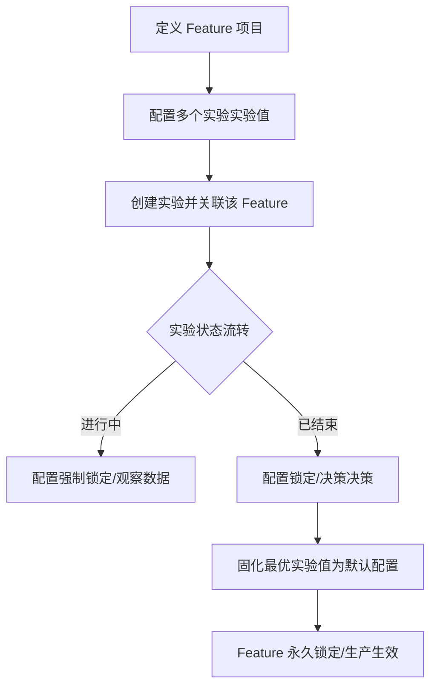

# PRD: Feature 配置库与实验生命周期联动管理

## 1. 业务愿景与核心逻辑
本系统旨在建立一套从“功能配置定义”到“A/B实验验证”再到“全量上线固化”的闭环管理体系。**Feature（功能特性）** 是系统的核心承载物，所有的实验都基于 Feature 的实验值开展，最终实验结论将反向作用于 Feature，完成配置的生产固化。

### 核心约束原则
1. **单一实验关联制**：一个 Feature 在同一时间内只能关联一个实验（无论实验处于草稿、进行中还是已结束状态）。
2. **状态锁定机制**：为了保证实验数据的严谨性，一旦 Feature 关联的实验进入“进行中”或“已结束”状态，该 Feature 及其实验值配置将进入只读锁定状态。
3. **固化即终态**：一旦某实验值被固化为默认配置，该 Feature 将永久锁定，作为生产环境的稳定配置。
4. **删除约束**：仅处于“未锁定”状态的 Feature（即未被进行中或已结束实验关联，且未固化的项目）允许删除。

---

## 2. 数据字典 (Data Definitions)

### 2.1 Feature 项目 (Feature Project)
Feature 是实验的父级载体，定义了一个功能模块的基础属性。

| 字段名称              | 字段 Key             | 数据类型 | 描述与限制                                                     |
| :-------------------- | :------------------- | :------- | :------------------------------------------------------------- |
| **Feature Flag 名称** | `name`               | String   | 用户可见的显示名称，如“主底按钮样式”。需具备业务识别度。       |
| **Feature Key**       | `key`                | String   | **全局唯一标识**。系统后台识别功能的唯一凭证。创建后不可修改。 |
| **固化状态**          | `isSolidified`       | Boolean  | 默认为 `false`。由于实验结论固化后变为 `true`。                |
| **默认实验值 ID**     | `defaultVariationId` | ID       | 固化后指向的生产环境生效实验值 ID。                            |

### 2.2 实验值配置 (Experimental Values / Variations)
实验值是具体功能的参数实现方案，包含基础参数配置及业务关联参数（如课程绑定）。

#### A. 基础参数配置 (Params)
| 字段名称       | 子字段 Key | 数据类型 | 描述与约束                                                    |
| :------------- | :--------- | :------- | :------------------------------------------------------------ |
| **实验值名称** | `name`     | String   | 实验值的描述，如“蓝色大按钮版本”。                            |
| **参数 Key**   | `key`      | String   | 参数名，如 `font_size`。                                      |
| **参数类型**   | `type`     | Enum     | 包含 `string` (字符串), `number` (数字), `boolean` (布尔值)。 |
| **参数 Value** | `value`    | String   | 参数的具体值。                                                |

#### B. 课程绑定 (Courses - 业务参数)
针对课程相关功能的特殊配置，支持多维度组合绑定及排除逻辑。

| 字段名称     | 字段 Key  | 数据类型           | 描述                                                 |
| :----------- | :-------- | :----------------- | :--------------------------------------------------- |
| **选择模式** | `mode`    | Enum               | **选中 (include)** / **排除 (exclude)**。            |
| **SPU**      | `spu`     | Enum               | 游戏化(`gamified`), 传统直播(`traditional`)等。      |
| **SKU**      | `sku`     | Enum               | 具体币种或科目，如 日语(`ja`), 韩语(`ko`)。          |
| **Lessons**  | `lessons` | Hierarchical Array | 支持多级分类（如 Level > Unit > Lesson）的层级选择。 |

---

## 3. 用户旅程地图 (User Journey Map)

---

## 4. 用户故事集 (User Stories)

### 第一阶段：配置定义 (Definition)

#### 【故事 01】建立功能配置核
在配置库中清晰地定义功能特性及其参数结构。

*   **业务逻辑**：`Feature Key` 全系统唯一。
*   **验收标准**：重复 Key 无法创建。

#### 【故事 02】定义实验值（实验值）与高级课程选择
为一个实验值配置复杂的参数，包括能精确到具体 Lesson 的层级选择以及排除范围，使实验配置不仅能控制 UI 表现，还能精准控制不同课程范围内的业务逻辑。

*   **业务逻辑**：
    *   **层级 Lessons 选择**：Lessons 下拉框应展示目录结构（如分类目录 -> Lesson）。支持全选某个目录下的所有子项，也支持单选。
    *   **展示逻辑**：选择完毕后，输入框应平铺展示所有被选中的 Lesson 或目录。
    *   **模式切换 (选中/排除)**：支持设置该组 Lesson 为“选中”（在该范围内生效）或“排除”（在该范围内不生效）。
*   **用户可见行为**：
    *   弹窗宽度自动适配，给 Lessons `TreeSelect` 留出宽阔的操作空间。
    *   TreeSelect 开启 `treeCheckable`，支持复选框一键勾选整个层级。
    *   新增“模式”下拉框，默认值为“选中”。
*   **验收标准**：
    *   点击父节点能触发全选/取消全选子节点逻辑。
    *   选择结果需正确区分 inclusive (选中) 和 exclusive (排除) 逻辑。

---

### 第二阶段：实验联动 (Experimentation)

#### 【故事 03】基于 Feature 快速开启实验
*   **业务逻辑**：一个 Feature 只能关联一个实验。

#### 【故事 04】动态锁定与冲突保护
*   **业务逻辑**：关联实验状态为“进行中”或“已结束”时，激活锁定逻辑。实验值所有高级选择项（Lessons, 模式）均进入只读状态。

---

### 第三阶段：收敛固化 (Solidification)

#### 【故事 05】实验结论的产出与固化
*   **业务逻辑**：固化后的实验值配置（含选中/排除逻辑）成为生产全量默认。

---

## 5. UI 规范与状态机定义
### 5.1 页面搜索与筛选
*   **左对齐原则**：为了与实验管理页面保持一致，搜索框及状态筛选下拉框统一位于列表左上方。
*   **状态筛选器**：支持按“全部”、“未锁定”、“锁定中”、“已固化”进行过滤。

### 5.2 状态定义
*   **未锁定 (Unlocked)**：Feature 未关联实验，或关联实验处于“草稿”状态。支持自由修改。
*   **锁定中 (Locked)**：关联实验处于“进行中”或“已结束”状态（尚未固化）。Feature 及实验值配置转为只读。
*   **已固化 (Solidified)**：用户已手动将某一实验值结论“固化为默认”。Feature 永久只读锁定。

### 5.3 其他规范
*   **选中模式**: 正常形态。
*   **排除模式**: 建议在 UI 层面通过颜色或 Tag 前缀标注（如：`[排除] Lesson A`）以增强识别。
*   **锁定**: 黄色 - `#fa8c16` / 锁图标。
